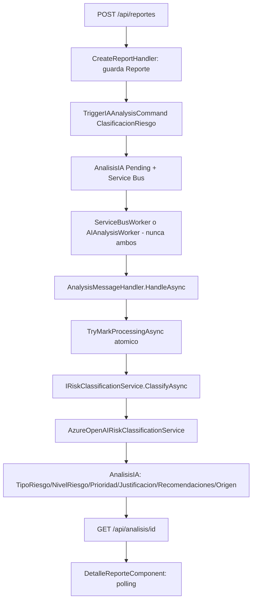

# Fase 3 — Implementación de clasificación de riesgos mediante IA

Documento técnico de la fase de alineación del software con los objetivos aprobados de la tesis
"Aplicativo web basado en IA para la identificación y gestión de riesgos laborales".

**No contiene resultados experimentales de tesis** (Precision/Recall/F1/SUS/pre-post). Esos se
producirán en una fase posterior, una vez autorizada.

---

## 1. Situación inicial (antes de esta fase)

Verificada en la fase de auditoría previa:

- No existía ninguna clasificación de riesgo mediante IA. El único mecanismo relacionado
  (`ReportesController.DeterminarNivelRiesgo`) era una función determinística de coincidencia de
  palabras clave, sin ninguna llamada a un modelo de IA.
- El análisis asíncrono existente (`AnalysisMessageHandler`/`AIAnalysisWorker`) solo generaba un
  resumen de texto libre (`"Analiza y resume: {Descripcion}"`), sin estructura ni clasificación.
- El análisis de IA debía dispararse manualmente (`POST /api/analisis/trigger/{id}`); no existía
  automatización al crear el reporte.
- `ServiceBusWorker` y `AIAnalysisWorker` podían competir por el mismo `AnalisisIA` cuando Service
  Bus estaba configurado (ambos se registraban incondicionalmente).
- No existía ningún campo estructurado para el resultado del análisis (`ResultadoJson` era solo
  `{ result: string, generatedAt }`).
- No existía trazabilidad del origen del resultado (IA real vs. heurístico vs. error).
- No existía ningún endpoint para consultar el resultado del análisis desde el frontend.
- El nivel de riesgo elegido por el usuario en el formulario no se persistía como campo
  estructurado (quedaba embebido como texto dentro de `Descripcion`).

## 2. Brecha encontrada

Objetivo 2 de la tesis ("clasificación de riesgos mediante IA y priorización según gravedad") no
estaba implementado. Objetivo 3 ("procesamiento mediante IA y generación de recomendaciones")
estaba parcialmente implementado solo en el Plan de Acción, no en el análisis inicial.

## 3. Cambios realizados

### 3.1 Clasificación de riesgo mediante IA (reutilizando Azure OpenAI existente)

- Nueva interfaz `IRiskClassificationService` (Application) y su implementación
  `AzureOpenAIRiskClassificationService` (Infrastructure), que reutiliza el mismo
  `IAzureOpenAIClient` ya existente (no se agregó un segundo proveedor de IA).
- El prompt solicita únicamente `tipoRiesgo`, `nivelRiesgo`, `justificacion` y `recomendaciones`
  en JSON estricto. La IA **no** determina `prioridad` (ver 3.2).
- El prompt **no incluye** el nivel de riesgo elegido por el usuario, para no sesgar la
  clasificación del modelo.
- Taxonomía de `tipoRiesgo` (no existía catálogo previo reutilizable): `FISICO, QUIMICO,
  BIOLOGICO, ERGONOMICO, PSICOSOCIAL` (metodología GTC-45 de la tesis).
- `nivelRiesgo`: `BAJO, MEDIO, ALTO, CRITICO`.

### 3.2 Relación NivelRiesgo → Prioridad

Regla fija, exclusivamente en backend (`Application/Common/PrioridadMapper.cs`), la IA nunca
determina ni sobrescribe la prioridad:

```
BAJO     -> BAJA
MEDIO    -> MEDIA
ALTO     -> ALTA
CRITICO  -> INMEDIATA
```

### 3.3 Nivel reportado por el usuario vs. nivel determinado por IA

- `Reporte.NivelReportadoUsuario` (nuevo campo estructurado, enum `NivelRiesgo?`): valor elegido
  manualmente por el usuario en el formulario, conservado sin modificar.
- `AnalisisIA.NivelRiesgo`: valor determinado por la clasificación de IA. Es el único que debe
  usarse para medir Precision/Recall/F1 en la fase de métricas.
- Ambos coexisten sin sobrescribirse mutuamente.

### 3.4 Automatización tras crear el reporte

`CreateReportHandler.Handle()`: después de `_repo.AddAsync(r)` (reporte ya persistido), envía
`TriggerIAAnalysisCommand(r.Id, AnalisisTipos.ClasificacionRiesgo)` vía MediatR, dentro de un
`try/catch` que nunca hace fallar la creación del reporte. Reutiliza `TriggerIAAnalysisCommand`,
`AnalisisIA` y Service Bus existentes; no se duplicó lógica.

### 3.5 Anti-doble-procesamiento entre workers

Dos medidas combinadas:

1. **Registro condicional** (`Program.cs`): `AIAnalysisWorker` solo se registra si
   `SERVICEBUS_CONNECTION` está vacío. Nunca coexiste con `ServiceBusWorker`.
2. **Reclamo atómico** (`IAnalysisRepository.TryMarkProcessingAsync`): actualización condicional
   `Pending -> Processing` (`ExecuteUpdateAsync` con `WHERE Status='Pending'` en proveedor
   relacional; fallback documentado para InMemory en desarrollo/pruebas). Solo quien obtiene
   `rowsAffected == 1` continúa; el otro aborta sin invocar Azure OpenAI. `AIAnalysisWorker` ahora
   delega en el mismo `AnalysisMessageHandler` que `ServiceBusWorker`, eliminando duplicación de
   lógica.

### 3.6 Estados y manejo de errores

- `AnalysisMessageHandler.HandleAsync` marca `Status = "Failed"` únicamente cuando
  `Origen == ERROR` (fallo real de Azure OpenAI tras reintentos); `NULL_CLIENT`/`HEURISTIC` se
  marcan `Completed` (resultado utilizable, origen trazable).
- `catch` adicional de defensa: cualquier excepción no controlada también cierra el análisis como
  `Failed` con `CompletedAt` fijado, evitando que quede indefinidamente en `Processing`.
- `CreatedAt`, `StartedAt`, `CompletedAt` tienen significado consistente para medir tiempos:
  `CreatedAt` = creación de la solicitud; `StartedAt` = momento del reclamo atómico
  (`TryMarkProcessingAsync`); `CompletedAt` = cierre definitivo (`Completed` o `Failed`).

### 3.7 Resultado estructurado

`AnalisisIA` (Domain) gana campos tipados: `TipoRiesgo`, `NivelRiesgo`, `Prioridad`,
`Justificacion`, `RecomendacionesJson`, `Origen`, `ErrorMensaje`. `ResultadoJson` se conserva como
copia íntegra de auditoría. Persistencia con `HasConversion<string>()` para los 4 enums (valores
legibles en BD, sin depender de ordinales).

### 3.8 Trazabilidad del origen (regla fundamental para las métricas de tesis)

`OrigenAnalisis`: `AZURE_OPENAI, HEURISTIC, NULL_CLIENT, ERROR`.

> **Regla obligatoria:** solo los registros con `Origen = AZURE_OPENAI` pueden considerarse
> predicciones de IA para calcular Precision/Recall/F1/F1 Macro/matriz de confusión.
> `HEURISTIC`, `NULL_CLIENT` y `ERROR` NUNCA deben mezclarse con esas métricas.

Aplicado también al Plan de Acción existente (`PlanAccionIAResult.Origen`), sin modificar
`BuildPlanAccionPrompt`/`BuildHeuristicPlan`/`SeleccionarNormativa`. Caso `ERROR`: se conserva el
origen real (`ERROR`) aunque, por continuidad operativa, el plan se complete con el fallback
heurístico — nunca se reclasifica como `HEURISTIC` para no ocultar que Azure OpenAI falló.

### 3.9 Endpoint de consulta

`GET api/Analisis/{id}` (`[Authorize]`): `ResponsableSST`/`Administrador` consultan cualquier
análisis; cualquier otro usuario autenticado solo el análisis de un reporte del cual es autor
(`403 Forbid` en caso contrario). Mensaje de error expuesto siempre genérico
(`"No fue posible completar el análisis del reporte..."`), nunca el detalle técnico interno.

### 3.10 Frontend

- `core/models/index.ts`: `AnalisisClasificacionIA`, `Reporte.analysisId?`.
- `core/services/reporte.service.ts`: `obtenerAnalisis(analysisId)`.
- `reportes/detalle-reporte/*`: bloque "Análisis IA" (Pending/Processing con spinner, Completed
  con resultado, Failed con mensaje genérico); polling moderado (4s) que se cancela en
  `Completed`/`Failed`/destrucción del componente — nunca infinito.

## 4. Arquitectura final (resumen)



## 5. JSON de clasificación (contrato con el modelo)

```json
{
  "tipoRiesgo": "FISICO|QUIMICO|BIOLOGICO|ERGONOMICO|PSICOSOCIAL",
  "nivelRiesgo": "BAJO|MEDIO|ALTO|CRITICO",
  "justificacion": "string",
  "recomendaciones": ["string", "..."]
}
```
`prioridad` se deriva siempre en backend, nunca se solicita al modelo.

## 6. AUC — decisión metodológica

Se mantiene la decisión de no implementar AUC artificialmente. El modelo no expone
probabilidades/scores calibrados por clase; agregar un campo "confianza" generado por el LLM
solo para poder calcular AUC constituiría una métrica sin validez metodológica. **Cuando
corresponda documentar resultados de tesis, AUC deberá reportarse como "no aplicable a esta
implementación".**

## 7. Archivos backend modificados/creados

**Nuevos:** `Domain/Entities/{TipoRiesgo,NivelRiesgo,PrioridadRiesgo,OrigenAnalisis}.cs`,
`Application/Common/{AnalisisTipos,PrioridadMapper}.cs`,
`Application/DTOs/{RiskClassificationRequest,RiskClassificationResult,AnalisisDto}.cs`,
`Application/Interfaces/IRiskClassificationService.cs`,
`Infrastructure/Services/AzureOpenAIRiskClassificationService.cs`,
`Infrastructure/Migrations/{...}_SyncPreexistingModel.cs`,
`Infrastructure/Migrations/{...}_AddAIClassificationFields.cs` (+ Designer, autogeneradas).

**Modificados:** `Domain/Entities/{Reporte,AnalisisIA}.cs`,
`Application/DTOs/ReportDto.cs`, `Application/Handlers/CreateReportHandler.cs`,
`Application/Interfaces/IAnalysisRepository.cs`,
`Infrastructure/Repositories/AnalysisRepository.cs`,
`Infrastructure/Background/{AnalysisMessageHandler,AIAnalysisWorker}.cs`,
`Infrastructure/Services/{IAIAnalysisService,AzureOpenAIService}.cs`,
`Infrastructure/Persistence/SecurityReportDbContext.cs`,
`Api/Controllers/{AnalisisController,ReportesController}.cs`, `Api/Program.cs`,
`tests/Tests.csproj` (agregado `Microsoft.NET.Test.Sdk`/`xunit.runner.visualstudio`/
`coverlet.collector`/referencia a `Api.csproj` — solo tooling de pruebas).

## 8. Archivos frontend modificados

`core/models/index.ts`, `core/services/reporte.service.ts`,
`reportes/detalle-reporte/detalle-reporte.component.{ts,html}` (+ campo
`analisisPollingIntervaloMs` para permitir pruebas rápidas sin `zone.js`),
`reportes/crear-reporte/crear-reporte.component.ts` (sin cambios de esta fase; pendiente si se
decide enviar `nivelReportadoUsuario` estructurado en una iteración futura).

## 9. Pruebas técnicas creadas (backend)

`RiskClassificationServiceTests`, `PrioridadMapperTests`, `AnalysisRepositoryConcurrencyTests`,
`AnalysisMessageHandlerTests`, `AnalisisControllerAuthorizationTests` — ver detalle de resultados
reales de ejecución en la sección 10.

## 10. Pruebas técnicas creadas (frontend)

`core/services/reporte.service.spec.ts`, `reportes/detalle-reporte/detalle-reporte.component.spec.ts`.

## 11. Resultados reales de ejecución (no inventados)

**Backend** (`dotnet test tests\Tests.csproj`):
```
Pruebas totales: 28
Correcto: 24
Incorrecto: 3   (preexistentes, no causados por esta fase — ver detalle abajo)
Omitido: 1      (preexistente, requiere Docker)
```
Fallos preexistentes (no modificados, no relacionados con esta fase):
- `ServiceBusWorkerTests.ProcessMessageHandler_DeadLetters_OnInvalidPayload` /
  `_CompletesMessage_OnValidPayload`: `Moq.NotSupportedException` al mockear
  `ProcessMessageEventArgs.Message` (miembro no invalidable del SDK de Azure). No se tocó
  `ServiceBusWorker.cs` en esta fase.
- `WorkerIntegrationWithContainerTests.WorkerProcessesPendingAnalysis_EndToEnd`: `TimeoutException`
  conectando a Docker (Testcontainers) — no hay Docker Desktop disponible en este entorno.
- `WorkerIntegrationTests.WorkerProcessesPendingAnalysis`: `Skip` explícito preexistente (mismo
  motivo de infraestructura Docker).

**Frontend** (`ng test`):
```
Total: 7
Passed: 7
Failed: 0
Skipped: 0
```

## 12. Bloqueo de tooling resuelto durante esta fase

`tests/Tests.csproj` no tenía `Microsoft.NET.Test.Sdk`/`xunit.runner.visualstudio`/
`coverlet.collector`, por lo que `dotnet test` nunca pudo ejecutar realmente ninguna prueba en
este entorno (solo compilaba). Se diagnosticó con `-v diag` (el test host intentaba cargar un
ensamblado de referencia `ref/net10.0/System.Runtime.Loader.dll` en tiempo de ejecución, sin
relación con AutoMapper) y se corrigió agregando exclusivamente esos tres paquetes de testing en
`tests/Tests.csproj`. No se cambió AutoMapper, ningún paquete productivo, ni el `TargetFramework`.

## 13. Migraciones — nota de reparación (drift preexistente)

Se detectó y corrigió un drift preexistente entre `ModelSnapshot` y tres migraciones manuales
(`AddTipoReporte`, `AddReportePlanAccionMetadata`, `AddRolePermissions`) que EF Core nunca
reconoció como migraciones válidas (sin `[Migration]`/`.Designer.cs`). Se generó
`SyncPreexistingModel` (todo el drift preexistente) seguida de `AddAIClassificationFields` (solo
los campos de esta fase), ambas mediante `dotnet ef migrations add`, sin editar manualmente
Snapshot/Designer. **Ninguna migración fue aplicada a una base de datos real** (`dotnet ef
database update` no se ejecutó); eso requiere autorización explícita adicional cuando exista un
entorno con SQL Server real disponible.

## 14. Pendiente (fuera de alcance de esta fase, explícitamente no implementado aún)

Precision, Recall, F1, F1 Macro, matriz de confusión, SUS, resultados pre/post. Requieren datos
etiquetados y/o usuarios reales, y fueron explícitamente excluidos de esta fase.

---

## 15. CIERRE DE VALIDACIÓN TÉCNICA

### 15.1 Pruebas backend ejecutadas

**Ejecución sin filtro** (`dotnet test tests\Tests.csproj -c Debug` / `dotnet test SecurityReport.sln -c Debug`, resultados idénticos en ambos):
```
Total: 32
Passed: 28
Failed: 1   (WorkerIntegrationWithContainerTests — requiere Docker, ver 15.4)
Skipped: 3  (2 ServiceBusWorkerTests + 1 WorkerIntegrationTests, ver 15.3/15.4)
Duration: ~2.5 s
```

**Ejecución estándar recomendada** (excluyendo explícitamente los tests dependientes de Docker):
```
dotnet test tests\Tests.csproj -c Debug --filter "Category!=RequiresDocker"
```
```
Total: 30
Passed: 28
Failed: 0
Skipped: 2  (ServiceBusWorkerTests, ver 15.3)
Duration: ~2.5 s
Resultado: "La serie de pruebas se ejecutó correctamente."
```
Este es el comando recomendado para el desarrollo diario: distingue con claridad **PASSED** (funcionalidad ejecutada y correcta), **SKIPPED** (prueba legítima no ejecutable en este entorno, con motivo documentado) y **FAILED** (0 — ningún defecto real pendiente). El único test que aparece como "Failed" en la ejecución sin filtro es exclusivamente el que depende de Docker, categorizado y excluible.

Se agregaron 4 pruebas nuevas dedicadas al Plan de Acción (`AzureOpenAIServicePlanAccionTests`),
todas en verde. Total de pruebas nuevas de esta fase (clasificación + Plan de Acción +
concurrencia + estados + autorización): 15, todas correctas.

### 15.2 Pruebas frontend ejecutadas (`npx ng test --watch=false --browsers=ChromeHeadless`)

```
Total: 7
Passed: 7
Failed: 0
Skipped: 0
```
Sin cambios respecto a la fase anterior (no se modificaron por seguir pasando).

### 15.3 Corrección de tests obsoletos — `ServiceBusWorkerTests` (2 tests)

**Decisión final: NO se actualiza `Azure.Messaging.ServiceBus` productivo únicamente para
habilitar estos tests.** Se confirmó por reflexión sobre el ensamblado real instalado
(`Azure.Messaging.ServiceBus 7.17.0`) que:
- `ServiceBusModelFactory` **no expone ningún método** para crear `ProcessMessageEventArgs`/
  `ProcessErrorEventArgs` en esta versión (funcionalidad agregada en versiones posteriores del SDK).
- `ProcessMessageEventArgs` tiene un constructor sin parámetros (para permitir un proxy de Moq),
  pero **todas sus propiedades son no-virtuales**, por lo que ningún `Setup()` de Moq puede
  funcionar sobre ellas.
- Los constructores alternativos requieren `ReceiverManager`, un tipo **interno** del SDK.

**Estado final:** `ProcessMessageHandler_CompletesMessage_OnValidPayload` y
`ProcessMessageHandler_DeadLetters_OnInvalidPayload` quedan marcados **`[Fact(Skip = "...")]`**
(`tests/Unit/ServiceBusWorkerTests.cs`) con el motivo técnico completo documentado en el propio
código fuente. No se eliminaron, no se modificó `ServiceBusWorker` productivo.

**Cobertura alternativa confirmada** (sin requerir `ProcessMessageEventArgs`), en
`AnalysisMessageHandlerTests`:
- `AnalysisId` válido llega y se procesa correctamente → `HandleAsync_SuccessfulClassification_MarksCompleted`.
- Solo se procesa cuando `TryMarkProcessingAsync` devuelve `true` → `AnalysisRepositoryConcurrencyTests` + `HandleAsync_CalledTwice_OnlyClassifiesOnce`.
- Una segunda ejecución no vuelve a clasificar → `HandleAsync_CalledTwice_OnlyClassifiesOnce` (verifica `Times.Once` sobre `ClassifyAsync`).
- Error termina en `Failed` → `HandleAsync_OrigenError_MarksFailed`, `HandleAsync_UnhandledException_MarksFailed_NeverStaysProcessing`.
- Clasificación exitosa termina en `Completed` → `HandleAsync_SuccessfulClassification_MarksCompleted`.

**Limitación documentada (no cubierta por unit tests, requiere integración real):** la mecánica
específica de `CompleteMessageAsync`/`DeadLetterMessageAsync` sobre un mensaje real de Service Bus
(la parte que sí depende de `ProcessMessageEventArgs`) queda pendiente de una prueba de integración
con Service Bus real; no existe hoy un test automatizado para esa porción exacta.

**Mejora futura (no realizada en esta tesis):** evaluar actualización controlada de
`Azure.Messaging.ServiceBus` en una tarea independiente, con análisis de breaking changes y
pruebas de regresión — no como parte de esta fase, cuyo único motivo para tocarlo sería facilitar
testing.

### 15.4 Test dependiente de Docker

`WorkerIntegrationWithContainerTests.WorkerProcessesPendingAnalysis_EndToEnd` (y el placeholder
`WorkerIntegrationTests.WorkerProcessesPendingAnalysis`) permanecen identificados como:

> **[PENDIENTE DE EJECUCIÓN EN ENTORNO CON DOCKER]**

No tienen defecto lógico demostrado — dependen exclusivamente de Docker/Testcontainers, no
disponible en este entorno. No se modificó su lógica, no se simuló Docker, no se reemplazó SQL
Server por InMemory, y no se los marcó como `Passed` sin ejecutar la integración real.

**Clasificación aplicada:** `[Trait("Category", "RequiresDocker")]` en ambas clases de test
(mecanismo estándar de xUnit ya disponible, sin agregar paquetes nuevos). La ejecución local
estándar recomendada los excluye explícitamente:
```
dotnet test tests\Tests.csproj -c Debug --filter "Category!=RequiresDocker"
```
Ejecutables en una máquina con Docker Desktop, un runner de CI con soporte Testcontainers, o un
entorno de integración preparado — sin ningún cambio de código.

### 15.5 Pruebas del origen del Plan de Acción

`tests/Unit/AzureOpenAIServicePlanAccionTests.cs` (4 pruebas, todas en verde, sin llamadas reales
a Azure — solo `Mock<IAzureOpenAIClient>`):

| Caso | Origen esperado | GeneradoConIA | Resultado |
|---|---|---|---|
| JSON válido | `AZURE_OPENAI` | `true` | ✅ Passed |
| JSON no vacío pero inválido | `HEURISTIC` | `false` | ✅ Passed |
| Respuesta vacía (cliente no configurado) | `NULL_CLIENT` | `false` | ✅ Passed |
| Excepción del cliente | `ERROR` | `false` (con `ErrorMensaje` registrado) | ✅ Passed |

En los 4 casos se verificó estructura completa (`acciones`, `recursos`, `responsable`,
`tiempoEjecucion`, `normativaAplicable`, `disclaimer`).

### 15.6 Estado del smoke test Azure OpenAI real

```
AZURE_OPENAI_ENDPOINT:    NO CONFIGURADA
AZURE_OPENAI_API_KEY:     NO CONFIGURADA
AZURE_OPENAI_DEPLOYMENT:  NO CONFIGURADA
```

> **[PENDIENTE DE PRUEBA CON AZURE OPENAI REAL]**

No se ejecutó ni se simuló. Procedimiento documentado para cuando existan credenciales
autorizadas (ver sección 15.7).

### 15.7 Procedimiento del smoke test real (documentado, no ejecutado)

**Entrada de prueba (identificable, sin datos personales):**
```
Titulo: Cable eléctrico expuesto
Descripcion: Se observa un conductor eléctrico con aislamiento deteriorado en una zona
             de circulación de trabajadores.
```
`NivelReportadoUsuario` no se incluye como entrada sugerida al modelo (ya excluido del prompt de
producción, ver sección 3.1).

**Pasos:**
1. `POST /api/reportes` con el reporte de prueba → confirmar `201 Created` y `analysisId` en la
   respuesta.
2. Confirmar en BD que `AnalisisIA` se creó con `Status = Pending`.
3. Esperar el ciclo del worker (Service Bus o `AIAnalysisWorker`) → confirmar transición a
   `Processing` y luego a `Completed` (verificar `StartedAt`/`CompletedAt` no nulos).
4. Confirmar que `TipoRiesgo` y `NivelRiesgo` pertenecen a los catálogos cerrados
   (`FISICO|QUIMICO|BIOLOGICO|ERGONOMICO|PSICOSOCIAL`, `BAJO|MEDIO|ALTO|CRITICO`).
5. Confirmar que `Prioridad` corresponde exactamente al mapeo fijo de `PrioridadMapper` a partir
   del `NivelRiesgo` recibido.
6. Confirmar `Origen = AZURE_OPENAI` (nunca `HEURISTIC`/`NULL_CLIENT`/`ERROR` para que cuente como
   una invocación real).
7. `GET /api/analisis/{analysisId}` → confirmar que devuelve exactamente esos campos.
8. Confirmar en el frontend (`DetalleReporteComponent`) que el polling muestra el resultado
   correctamente tras la consulta.

**Este procedimiento, al ejecutarse, es un smoke test de integración puntual — no produce por sí
mismo ninguna métrica de tesis (Precision/Recall/F1/etc.).**

### 15.8 Migraciones verificadas

```
dotnet ef migrations list --project src/Infrastructure/Infrastructure.csproj --startup-project src/Api/Api.csproj
```
```
20260411222829_InitialCreate
20260910193047_SyncPreexistingModel
20260910193124_AddAIClassificationFields
```
Cadena confirmada, sin las migraciones manuales antiguas. **Ninguna migración fue aplicada a una
base de datos persistente** (`dotnet ef database update` no se ejecutó en ningún momento de esta
fase).

### 15.9 Conclusión

```
BACKEND TESTS (ejecución estándar, --filter "Category!=RequiresDocker"):
  Total: 30 / Passed: 28 / Failed: 0 / Skipped: 2

BACKEND TESTS (ejecución sin filtro, incluye prueba dependiente de Docker):
  Total: 32 / Passed: 28 / Failed: 1 (RequiresDocker) / Skipped: 3

FRONTEND TESTS:
  Total: 7 / Passed: 7 / Failed: 0 / Skipped: 0

LISTO TÉCNICAMENTE PARA SMOKE TEST REAL:  SÍ
SMOKE TEST AZURE OPENAI REAL:             PENDIENTE
LISTO PARA EVALUACIÓN EXPERIMENTAL:       NO
```

**Falta para que la evaluación experimental pueda comenzar:**
1. Ejecutar el smoke test real con credenciales de Azure OpenAI autorizadas (sección 15.7).
2. (Opcional, no bloqueante) Ejecutar `WorkerIntegrationWithContainerTests`/`WorkerIntegrationTests`
   en un entorno con Docker disponible — no afecta directamente la clasificación IA que se
   evaluará experimentalmente, quedan como pruebas de integración pendientes
   (`Category=RequiresDocker`).

`ServiceBusWorkerTests` quedó cerrado en esta fase: marcado `Skip` con motivo técnico, sin tocar
`Azure.Messaging.ServiceBus` productivo, con cobertura alternativa confirmada (sección 15.3).

